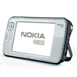

{:title  "Internet tablet - What's the point?"
 :layout :post
 :date   "2007-08-15"
 :tags   ["technology"]}

I have been recently introduced to Nokia's Internet Tablet
devices. The latest member of the family, [Nokia N800](http://europe.nokia.com/n800),
is a palm-sized device with a generous touch-screen. It comes with 
a traditional stylus and is Bluetooth and Wi-fi (802.11 b/g) enabled.
The underlying operating system is called Internet Tablet OS 2007 which is
derived from Linux Debian. The presentation stack - dubbed Maemo - uses a
higher layer of abstraction called Hildon.

The N800 really caught my attention the first time I had it in my
hands even though I found amazingly strange that it does not have a
3G-compatible phone embedded in it. Although the device is highly
portable and greatly flexible, it can not be used to make phone calls
using the traditional cell network. Why would Nokia make a device that
is not a phone? What is the main point behind it?

The main sale point of the device is not the same as a traditional PDA
concept (Personal Digital Assistant - powerful agendas) or the
Smartphone idea (powerful mobile phones) or the iPhone concept (a
powerful MP3 player that makes phone calls). It is clear that Nokia is
trying to create a new kind of portable device here. It might even be
as clear as it is stressed on the product family name: "Internet
Tablet".

Nokia is creating a small internet surfing device targeted to people
that have Wi-fi networks within reach, have a limited use of internet
(e-mail, surfing, Skype, etc) and are willing to carry a small device
around (and pay a couple of hundred Euros in the way). This might be
the birth of a separate family of products. A family of products that
are not PDAs, nor Smartphones and nor powerful iPods. They are simply
Internet Tablets.

But will the idea become a success? Is it a profitable concept? We
have seen the Palm PDA fever then the PocketPC one and now big players
are fighting over Smartphones (PocketPC versus Symbian) and Apple is
creating their own parallel universe with super iPods that eventually
work as telephones.

I have a feeling that Nokia is making the right move mainly when
deciding to use Linux-based OS. Open-sourced OSs running on mobile
devices might change definitely the way we use mobile computing.

It is worth paying attention to were the market will lead us.
